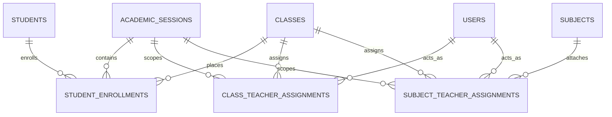

# Product Requirements Document (PRD)
# Gracemark Academy Hub — Comprehensive School Management & Academic Portal

**Document Version:** 2.0.0  
**Status:** Approved & Implemented  
**Date:** September 2026  
**Target Platform:** Web (Desktop, Tablet, Mobile-first Responsive)  
**Stack:** Next.js 14+ (App Router), TypeScript, Supabase (PostgreSQL, Auth, Storage, RLS), Tailwind CSS / Vanilla CSS, Paystack API, Vercel  

---

## 1. Executive Summary & Vision

### 1.1 Vision Statement
Gracemark Academy Hub is an enterprise-grade, integrated School Information Management System (SIMS) and Academic Portal designed specifically for primary and secondary educational institutions following modern Nigerian and West African educational standards. The platform serves as the single source of truth for the entire institutional lifecycle: from prospective student online admissions and payment collection to academic session-first student enrollments, dual-track teacher assignments, 10-week continuous assessment mark sheets, terminal broadsheets, report card generation, and tuition finance.

### 1.2 Core Problem Statement
Traditional school management portals frequently suffer from four critical architectural deficiencies:
1. **Destructive Student Placement**: Promoting a student from JSS 1 to JSS 2 directly overwrites `students.class_id`, corrupting historical report cards from past sessions.
2. **Conflated Teacher Roles**: Blending Class Teachers (attendance, pastoral care, remarks) with Subject Teachers (subject instruction and score entry) causes confusion and security leaks.
3. **Session-Blind Data Structures**: Without strict scoping by `academic_session_id`, teacher assignments and student results bleed across years.
4. **High Licensing Overheads**: Forcing staff to maintain expensive Google Workspace email licenses solely for portal authentication increases operating costs.

Gracemark Academy Hub resolves all these deficiencies with an **Academic Session-First Foundation**, strict separation of Class Teachers vs. Subject Teachers with full replacement audit history, non-destructive session enrollments, standardized Staff IDs (`GMA-T-XXX`), and admin-controlled password resets with forced first-login credentials updates.

---

## 2. User Personas & Role Matrix

| Role | Access Level | Description & Core Responsibilities | Authentication Identifier |
| :--- | :--- | :--- | :--- |
| **Super Admin / Principal** | Level 4 (Full System) | Institutional oversight, academic calendar management, term lock/unlock, teacher assignments, class promotions, score approvals, fee structures, financial reconciliation, broadsheets. | Admin Email |
| **Academic Admin / Bursar** | Level 3 (Operations) | Student enrollment, admissions review, fee payment recording, fee status toggling, report card publishing, student password resets. | Staff Email / Admin Email |
| **Class Teacher** | Level 2A (Class Scoped) | One teacher per class/section per session. Responsible for daily attendance, affective/psychomotor domains, class student welfare, and class teacher terminal remarks. | Staff ID (e.g. `GMA-T-001`) or Email |
| **Subject Teacher** | Level 2B (Subject Scoped) | Assigned to specific subjects in specific classes. Enters weekly continuous assessments (CW, HW, Tests, Projects) and examination marks for assigned subjects only. | Staff ID (e.g. `GMA-T-002`) or Email |
| **Student** | Level 1 (Personal Scoped) | Views terminal report cards, continuous assessment checkpoints, financial statements, bills, receipts, and class timetable. | Admission Number (e.g. `GMA202501`) or Email |
| **Parent / Guardian** | Level 1 (Ward Scoped) | Accesses ward's academic standing, progress reports (PR1, PR2, PR3, TR), pays school fees via Paystack, downloads official signed report cards. | Student Admission No / Parent Email |
| **Admissions Applicant** | Public / Guest | Fills online application form, uploads credentials, pays application fee via Paystack, tracks admission decision status. | Application Ref (`PAY-XXX` / Email) |

---

## 3. Information Architecture & Sitemap

```
Gracemark Academy Hub
├── Public & Admissions
│   ├── /                                    [Unified Portal Login: Staff ID, Admission No, Email]
│   ├── /admission-form                      [Public Online Admission Application Form]
│   ├── /form                                [General Admission Inquiry & Direct Application]
│   └── /change-password                     [Forced Security Setup for Temporary Passwords]
│
├── Student & Parent Portal (/student)
│   ├── /student/dashboard                   [Academic standing, announcements, quick links]
│   ├── /student/result                      [Report Card Checker: session-filtered, printable]
│   ├── /student/assessments                 [Continuous Assessment Checkpoints: PR1, PR2, PR3]
│   ├── /student/profile                     [Biographical information, institutional record]
│   ├── /student/school-fees                 [Current fee bill, Paystack checkout, installment breakdown]
│   ├── /student/payment-history             [Historical payments, transaction references]
│   ├── /student/receipts                    [Printable official PDF/HTML payment receipts]
│   ├── /student/financial-report            [Comprehensive fee ledger & statement of account]
│   └── /student/locked                      [Financial restriction lock screen for overdue balances]
│
├── Teacher Portal (/teacher)
│   ├── /teacher/dashboard                   [Assigned classes/subjects overview, pending tasks]
│   ├── /teacher/score-entry                 [Continuous Assessment Mark Sheet: CW/10, HW/5, Test/10, Prj/5, Exam/70]
│   ├── /teacher/attendance                  [Class Teacher Daily Register: Present/Absent/Late/Excused]
│   ├── /teacher/remarks                     [Affective/Psychomotor domain ratings & Terminal Remarks]
│   ├── /teacher/gradebook                   [Consolidated subject performance overview]
│   └── /teacher/assessments                 [Term assessment submissions and verification status]
│
└── Administration Portal (/admin)
    ├── /admin/dashboard                     [KPI metrics: Student count, fee collections, pending approvals]
    ├── /admin/students                      [Roster, manual creation, Excel bulk upload, password reset]
    ├── /admin/students/access               [Portal access lockdown/unblock by student or class]
    ├── /admin/students/payment-status       [Financial status override & fee reconciliation]
    ├── /admin/teachers                      [3-Tab Manager: Staff Directory, Class Teachers, Subject Teachers]
    ├── /admin/subjects                      [Curriculum subjects catalog, Junior/Senior categorization]
    ├── /admin/promotions                    [Session-to-session promotion engine, graduation, repeat]
    ├── /admin/approvals                     [Moderation & approval queue for teacher score submissions]
    ├── /admin/exams                         [Consolidated class broadsheets & batch report card publishing]
    ├── /admin/remarks                       [Principal's terminal remarks & signature authorization]
    ├── /admin/admissions/applicants         [Applicant pipeline: review, interview scheduling, admit]
    ├── /admin/admissions/forms              [Online admission forms management]
    ├── /admin/finance/fees                  [Tuition fee structure setup per class & session]
    ├── /admin/finance/payments              [All payment transactions, manual logging, Paystack sync]
    ├── /admin/finance/reports               [Revenue, outstanding debtor ledgers, term financial summaries]
    └── /admin/settings/portal-access        [Academic session switch, term locks, score edit overrides]
```

---

## 4. Core System Architecture & Data Foundations

### 4.1 Session-First Architectural Principle
All academic entities at Gracemark Academy are strictly scoped to an `academic_session_id`.
- The current active session is designated by `is_active = true` in `academic_sessions`.
- Past sessions (e.g. `2024/2025`, `2025/2026`) are immutable historical records.
- When an administrative action occurs (such as score entry, attendance, or enrollment), it references the active academic session by foreign key.

### 4.2 Non-Destructive Student Enrollments (`student_enrollments`)
To ensure complete historical integrity:
1. When a student is admitted, an entry is created in `student_enrollments` for that session and class with `status = 'active'`.
2. When the student is promoted to the next class in a new session (e.g. JSS 1 $\to$ JSS 2 in `2026/2027`):
   - The past enrollment record in `2025/2026` is preserved and updated to `status = 'promoted'`.
   - A brand new enrollment record is created for `2026/2027` with `class_id = [JSS 2]` and `status = 'active'`.
3. Historical report cards for `2025/2026` resolve the student's class through `student_enrollments`, correctly displaying **JSS 1**, while current records for `2026/2027` display **JSS 2**.



### 4.3 Separation of Class Teacher vs. Subject Teacher

#### A. Class Teacher Assignment (`class_teacher_assignments`)
- **Cardinality**: Exactly one active Class Teacher per `(academic_session_id, class_id, section_id)`.
- **Enforcement**: Partial PostgreSQL unique index:
  ```sql
  CREATE UNIQUE INDEX uq_active_class_teacher 
  ON public.class_teacher_assignments (academic_session_id, class_id, COALESCE(section_id, '00000000-0000-0000-0000-000000000000'::uuid)) 
  WHERE status = 'active';
  ```
- **Responsibilities**:
  - Class daily attendance marking and term attendance statistics.
  - Class pastoral care and monitoring.
  - Student Affective and Psychomotor domain scoring.
  - Class Teacher terminal remarks.

#### B. Subject Teacher Assignment (`subject_teacher_assignments`)
- **Cardinality**: Independent assignments per `(academic_session_id, class_id, section_id, subject_id, teacher_user_id)`.
- **Enforcement**: Partial unique index ensures only one active teacher per subject in a class:
  ```sql
  CREATE UNIQUE INDEX uq_active_subject_teacher 
  ON public.subject_teacher_assignments (academic_session_id, class_id, subject_id, COALESCE(section_id, '00000000-0000-0000-0000-000000000000'::uuid)) 
  WHERE status = 'active';
  ```
- **Responsibilities**:
  - Scores entry for that specific subject only.
  - Selecting a class in the Teacher Portal dynamically filters the subject selector strictly to the subjects assigned to that teacher for that class.

#### C. Replacement & Full Audit History
- When an administrator replaces a teacher mid-term:
  1. The existing active assignment is updated to `status = 'ended'`, `end_date = CURRENT_DATE`, with optional `replacement_notes`.
  2. The incoming teacher record is inserted with `status = 'active'`, `start_date = CURRENT_DATE`.
  3. No past marks, attendance records, or audit trails are deleted or overwritten.
  4. Administrators can view the complete chronological teacher lineage via the **"View History"** modal.

---

## 5. Detailed Functional Specifications by Module

### Module 1: Authentication, RBAC & Identity Management
1. **Multi-Identifier Login**:
   - The login endpoint accepts:
     - **Students**: Student Admission Number (e.g. `GMA202501`) or student email.
     - **Teachers & Staff**: Standardized Staff ID (e.g. `GMA-T-001`, `GMA-T-002`) or personal email.
     - **Super Administrators**: Official administrative email.
   - The system automatically resolves non-email inputs against `students.admission_no` and `users.staff_id`.
2. **Staff ID System**:
   - Teachers are automatically provisioned with a sequential Staff ID (`GMA-T-001`, `GMA-T-002`).
   - Personal emails (e.g. Gmail) are kept as secondary contact/recovery addresses, eliminating the need to pay for Google Workspace / Microsoft 365 mailboxes for each teacher.
3. **Admin Student Password Reset**:
   - In `/admin/students`, the admin can click **"Reset Pass"** on any student row.
   - The system generates an unguessable temporary password (e.g. `Gma@48291`), updates Supabase Auth via Admin API, and sets `must_change_password = true` on both `students` and `users`.
   - The admin is shown a copyable credential slip containing Student Name, Admission Number, Temporary Password, and login URL to hand to the parent/student.
4. **Forced Password Change Flow (`/change-password`)**:
   - If any user with `must_change_password = true` logs in, they are immediately redirected to `/change-password`.
   - The user must enter and confirm a new permanent password (minimum 6 characters).
   - Upon successful change, the flag is cleared in the database and the user is routed to their respective portal dashboard.

---

### Module 2: Continuous Assessment (CA) & Grading Engine

Gracemark Academy operates a strict **10-Week Continuous Assessment System** aligned with the master academic spreadsheet:

#### 5.2.1 Assessment Breakdown & Weights
| Assessment Component | Frequency / Structure | Raw Item Scoring | Scaled CA Weight |
| :--- | :--- | :--- | :--- |
| **Classwork (CW)** | Weeks 1 to 10 (10 entries) | Each scored /10 | Average scaled to **/10** |
| **Homework (HW)** | Weeks 1 to 10 (10 entries) | Each scored /10 | Average scaled to **/5** |
| **Continuous Tests** | Test 1 (/15), Test 2 (/15), Test 3 (/30) | Raw sum /60 | Scaled to **/10** |
| **Term Project** | 1 Milestone Project | Scored /5 | Scaled to **/5** |
| **Continuous Assessment (CA) Subtotal** | CW(10) + HW(5) + Tests(10) + Project(5) | — | **/30** |
| **Terminal Examination** | 1 End-of-Term Examination | Scored /70 | **/70** |
| **Terminal Total (TR)** | CA Subtotal (30) + Examination (70) | — | **/100** |

#### 5.2.2 Checkpoint Progress Reports (PR)
Teachers track student learning through cumulative progress checkpoints:
- **PR1 (Week 4 Progress Report)**:
  $$\text{PR1 Score} = \text{Avg}(\text{CW}_{1-4})/10 + \text{Avg}(\text{HW}_{1-4})/5 + \text{Test}_1/15 \implies \text{CA}/30 \quad (\text{Percentage} = \text{CA} \times \frac{10}{3})$$
- **PR2 (Week 7 Mid-Term Progress Report)**:
  $$\text{PR2 Score} = \text{Avg}(\text{CW}_{1-7})/10 + \text{Avg}(\text{HW}_{1-7})/5 + \text{Avg}(\text{Test}_1, \text{Test}_2)/15 \implies \text{CA}/30$$
- **PR3 (Week 10 Pre-Exam Progress Report)**:
  $$\text{PR3 Score} = \text{Avg}(\text{CW}_{1-10})/10 + \text{Avg}(\text{HW}_{1-10})/5 + \text{ScaledTests}(\text{T}_1, \text{T}_2, \text{T}_3)/15 \implies \text{CA}/30$$
- **TR (Terminal Result)**: Full terminal mark sheet calculation (/100).

#### 5.2.3 Grading Scales
The grading engine dynamically selects the grading scale based on class level:

**Senior Secondary Scale (SSS 1 to SSS 3):**
- $75 - 100$: **A1** (Excellent)
- $70 - 74$: **B2** (Very Good)
- $65 - 69$: **B3** (Good)
- $60 - 64$: **C4** (Credit)
- $55 - 59$: **C5** (Credit)
- $50 - 54$: **C6** (Credit)
- $45 - 49$: **D7** (Pass)
- $40 - 44$: **E8** (Pass)
- $0 - 39$: **F9** (Fail)

**Junior Secondary Scale (JSS 1 to JSS 3 & Primary):**
- $75 - 100$: **A** (Distinction)
- $65 - 74$: **B** (Very Good)
- $50 - 64$: **C** (Good)
- $40 - 49$: **D** (Pass)
- $0 - 39$: **F** (Fail)

#### 5.2.4 Score Submission & Admin Approval Workflow
1. **Draft Mode**: Teacher can save scores as draft at any time. Drafts are editable.
2. **Submit to Admin**: Once finalized, the teacher clicks "Submit to Admin". The record status becomes `submitted`.
3. **Admin Moderation Queue (`/admin/approvals`)**:
   - The academic admin inspects submitted scores, grade distribution, and class averages.
   - **Approve**: Scores transition to `approved` and become eligible for broadsheets and report cards.
   - **Return with Reason**: Admin can reject submissions with feedback (e.g. "Missing Test 3 for 4 students"). Status reverts to `rejected` and appears on the teacher's dashboard with the rejection reason.

---

### Module 3: Student Promotions & Historical Preservation

1. **Promotion Workflow (`/admin/promotions`)**:
   - Admin selects **Current Session** (e.g. `2025/2026`) and **Target Next Session** (e.g. `2026/2027`).
   - Admin selects the class to promote (e.g. JSS 1).
   - System displays the promotion decision table:
     - **Promote**: Advanced to next class (e.g. JSS 2).
     - **Repeat**: Retained in the same class (JSS 1) in the new session.
     - **Graduate**: For final year students (SSS 3), marked as `graduated`.
     - **Withdraw**: For students leaving the school.
2. **Database Execution**:
   - Existing enrollment row: `status` updated to `promoted`, `repeated`, or `graduated`.
   - New enrollment row created in `student_enrollments` with target `academic_session_id`, target `class_id`, and `status = 'active'`.
   - No result from the previous session is overwritten or altered.

---

### Module 4: Attendance Management
1. **Access Control**: Scoped exclusively to the assigned **Class Teacher** for that class and session.
2. **Daily Register**:
   - Radio buttons per student: `Present` (P), `Absent` (A), `Late` (L), `Excused` (E).
   - One-click "Mark All Present" button.
3. **Cumulative Metrics Computed**:
   - `times_school_opened`: Total days attendance was recorded.
   - `times_present`: Number of days student was marked Present or Late.
   - `times_absent`: Number of days marked Absent.
   - These totals are automatically populated onto the terminal student report card.

---

### Module 5: School Fees, Billing & Paystack Integration

1. **Fee Configuration (`/admin/finance/fees`)**:
   - Tuition, ICT, Development, Uniform, Books fees defined per class and term.
2. **Payment Methods**:
   - **Online via Paystack**: Direct inline modal or redirect checkout with instant verification via `/api/verify-paystack-payment`.
   - **Direct Bank Transfer / Cash**: Bursar manually logs bank payments with bank teller / transaction reference.
3. **Payment Statuses**:
   - **FULLY PAID**: Balance $\le 0$.
   - **PARTIALLY PAID**: Paid $> 0$ and Balance $> 0$.
   - **UNPAID**: Paid $= 0$.
4. **Debtor Portal Locking (`/admin/students/access`)**:
   - Admin can toggle financial access restrictions.
   - When locked, student login redirects to `/student/locked`, showing the outstanding balance and payment options while withholding report card access.

---

### Module 6: Broadsheets & Official Report Cards

1. **Consolidated Class Broadsheet (`/admin/exams`)**:
   - Matrix displaying all students in a class horizontally, all subjects vertically.
   - Displays CA (30), Exam (70), Total (100), and Grade for every subject.
   - Computes:
     - Student Overall Total Score and Average.
     - Student Class Position / Rank (e.g. 1st, 2nd, 3rd... out of 25).
     - Subject Class Average, Highest Score, Lowest Score.
2. **Student Terminal Report Card**:
   - Official institutional design with Gracemark crest, student photo, admission number, session, and term.
   - True historical class from `student_enrollments`.
   - Subject score table with Continuous Assessment breakdown, exam score, grade, and teacher initials.
   - Attendance summary (Days Open, Days Present, Days Absent).
   - Affective & Psychomotor rating table (1 to 5 scale: Punctuality, Politeness, Honesty, Neatness, Teamwork, Sports).
   - Class Teacher and Principal remarks with verified electronic stamp/signature placeholders.
   - Printable directly via browser print styles with clean page-break formatting.

---

## 6. Complete Database Schema & Data Dictionary

### Core Tables Summary

```sql
-- 1. Academic Sessions
CREATE TABLE public.academic_sessions (
  id uuid PRIMARY KEY DEFAULT gen_random_uuid(),
  name text NOT NULL UNIQUE, -- e.g. '2026/2027'
  start_date date,
  end_date date,
  is_active boolean NOT NULL DEFAULT false,
  created_at timestamptz NOT NULL DEFAULT now()
);

-- 2. Classes & Sections
CREATE TABLE public.classes (
  id uuid PRIMARY KEY DEFAULT gen_random_uuid(),
  name text NOT NULL UNIQUE, -- e.g. 'JSS 1', 'SSS 1 Science'
  level text NOT NULL DEFAULT 'junior', -- 'junior' | 'senior' | 'primary'
  order_index int DEFAULT 0,
  created_at timestamptz NOT NULL DEFAULT now()
);

CREATE TABLE public.sections (
  id uuid PRIMARY KEY DEFAULT gen_random_uuid(),
  class_id uuid NOT NULL REFERENCES public.classes(id) ON DELETE CASCADE,
  name text NOT NULL, -- e.g. 'A', 'B', 'Gold'
  created_at timestamptz NOT NULL DEFAULT now(),
  UNIQUE (class_id, name)
);

-- 3. Student Enrollments (Session-First Student Placement)
CREATE TABLE public.student_enrollments (
  id uuid PRIMARY KEY DEFAULT gen_random_uuid(),
  student_id uuid NOT NULL REFERENCES public.students(id) ON DELETE CASCADE,
  academic_session_id uuid NOT NULL REFERENCES public.academic_sessions(id) ON DELETE RESTRICT,
  session text NOT NULL DEFAULT '',
  class_id uuid NOT NULL REFERENCES public.classes(id) ON DELETE RESTRICT,
  section_id uuid REFERENCES public.sections(id) ON DELETE SET NULL,
  status text NOT NULL DEFAULT 'active' CHECK (status IN ('active', 'promoted', 'repeated', 'graduated', 'withdrawn')),
  enrolled_at timestamptz NOT NULL DEFAULT now(),
  created_at timestamptz NOT NULL DEFAULT now(),
  UNIQUE (student_id, academic_session_id)
);

-- 4. Class Teacher Assignments (Attendance & Pastoral Care)
CREATE TABLE public.class_teacher_assignments (
  id uuid PRIMARY KEY DEFAULT gen_random_uuid(),
  academic_session_id uuid NOT NULL REFERENCES public.academic_sessions(id) ON DELETE RESTRICT,
  class_id uuid NOT NULL REFERENCES public.classes(id) ON DELETE CASCADE,
  section_id uuid REFERENCES public.sections(id) ON DELETE SET NULL,
  teacher_user_id uuid NOT NULL REFERENCES public.users(auth_id) ON DELETE CASCADE,
  status text NOT NULL DEFAULT 'active' CHECK (status IN ('active', 'ended')),
  start_date date NOT NULL DEFAULT CURRENT_DATE,
  end_date date,
  replacement_notes text,
  created_at timestamptz NOT NULL DEFAULT now()
);

-- 5. Subject Teacher Assignments (Curriculum & Score Entry)
CREATE TABLE public.subject_teacher_assignments (
  id uuid PRIMARY KEY DEFAULT gen_random_uuid(),
  academic_session_id uuid NOT NULL REFERENCES public.academic_sessions(id) ON DELETE RESTRICT,
  class_id uuid NOT NULL REFERENCES public.classes(id) ON DELETE CASCADE,
  section_id uuid REFERENCES public.sections(id) ON DELETE SET NULL,
  subject_id uuid NOT NULL REFERENCES public.subjects(id) ON DELETE CASCADE,
  teacher_user_id uuid NOT NULL REFERENCES public.users(auth_id) ON DELETE CASCADE,
  status text NOT NULL DEFAULT 'active' CHECK (status IN ('active', 'ended')),
  start_date date NOT NULL DEFAULT CURRENT_DATE,
  end_date date,
  replacement_notes text,
  created_at timestamptz NOT NULL DEFAULT now()
);

-- 6. Students
CREATE TABLE public.students (
  id uuid PRIMARY KEY DEFAULT gen_random_uuid(),
  user_id uuid REFERENCES public.users(auth_id) ON DELETE SET NULL,
  admission_no text NOT NULL UNIQUE,
  name text NOT NULL,
  class_id uuid REFERENCES public.classes(id) ON DELETE SET NULL,
  portal_access_status text NOT NULL DEFAULT 'ACTIVE' CHECK (portal_access_status IN ('ACTIVE', 'LOCKED')),
  portal_lock_reason text,
  must_change_password boolean NOT NULL DEFAULT false,
  created_at timestamptz NOT NULL DEFAULT now()
);

-- 7. Users / Staff Profiles
CREATE TABLE public.users (
  id uuid PRIMARY KEY DEFAULT gen_random_uuid(),
  auth_id uuid UNIQUE NOT NULL,
  email text UNIQUE NOT NULL,
  display_name text NOT NULL,
  role text NOT NULL CHECK (role IN ('admin', 'teacher', 'student')),
  staff_id text UNIQUE,
  phone text,
  is_active boolean NOT NULL DEFAULT true,
  must_change_password boolean NOT NULL DEFAULT false,
  created_at timestamptz NOT NULL DEFAULT now()
);

-- 8. Results
CREATE TABLE public.results (
  id uuid PRIMARY KEY DEFAULT gen_random_uuid(),
  student_id uuid NOT NULL REFERENCES public.students(id) ON DELETE CASCADE,
  subject_id uuid NOT NULL REFERENCES public.subjects(id) ON DELETE CASCADE,
  class_id uuid REFERENCES public.classes(id) ON DELETE SET NULL,
  academic_session_id uuid REFERENCES public.academic_sessions(id) ON DELETE SET NULL,
  term text NOT NULL CHECK (term IN ('term1', 'term2', 'term3')),
  session text NOT NULL DEFAULT '',
  ca_score numeric DEFAULT 0,
  exam_score numeric DEFAULT 0,
  total_score numeric DEFAULT 0,
  grade text,
  score_breakdown jsonb DEFAULT '{}'::jsonb,
  status text NOT NULL DEFAULT 'draft' CHECK (status IN ('draft', 'submitted', 'approved', 'rejected')),
  return_reason text,
  submitted_at timestamptz,
  approved_at timestamptz,
  created_at timestamptz NOT NULL DEFAULT now(),
  UNIQUE (student_id, subject_id, term, session)
);

-- 9. Attendance
CREATE TABLE public.attendance (
  id uuid PRIMARY KEY DEFAULT gen_random_uuid(),
  student_id uuid NOT NULL REFERENCES public.students(id) ON DELETE CASCADE,
  class_id uuid NOT NULL REFERENCES public.classes(id) ON DELETE CASCADE,
  academic_session_id uuid REFERENCES public.academic_sessions(id) ON DELETE SET NULL,
  term text NOT NULL,
  session text NOT NULL DEFAULT '',
  date date NOT NULL,
  status text NOT NULL CHECK (status IN ('present', 'absent', 'late', 'excused')),
  marked_by uuid REFERENCES public.users(auth_id),
  created_at timestamptz NOT NULL DEFAULT now(),
  UNIQUE (student_id, date)
);
```

---

## 7. Complete API Route Specifications

| Route Endpoint | Method | Role | Purpose & Description | Request / Payload Sample | Response Format |
| :--- | :--- | :--- | :--- | :--- | :--- |
| `/api/terms` | `GET` | Public / All | Fetches current session, active term, editing permissions. | None | `{ ok: true, current_term, current_session, active_session_id, terms: [...] }` |
| `/api/admin/terms/toggle-edit` | `POST` | Admin | Toggles score edit permission override for non-current terms. | `{ session, term, allow_edit }` | `{ ok: true, message: "Updated" }` |
| `/api/admin/teachers` | `GET`, `POST`, `PATCH` | Admin | Staff directory, teacher provisioning, employment status toggle (`active`/`former`). | `{ action: "toggle_status", user_id, is_active }` | `{ ok: true, teachers: [...] }` |
| `/api/admin/teachers/assignments` | `GET`, `POST` | Admin | Assigns or replaces class/subject teachers with automatic replacement audit history. | `{ type: "subject" \| "class", session_id, class_id, subject_id, teacher_user_id }` | `{ ok: true, message: "Assigned" }` |
| `/api/admin/enrollments` | `GET`, `POST` | Admin | Retrieves or enrolls students into specific sessions. | `{ student_id, academic_session_id, class_id }` | `{ ok: true, enrollments: [...] }` |
| `/api/admin/students/reset-password` | `POST` | Admin | Generates random temporary password (`Gma@XXXXX`) and sets `must_change_password`. | `{ student_id }` | `{ ok: true, temporary_password: "...", admission_no }` |
| `/api/auth/change-password` | `POST` | Authenticated | Updates user password and clears `must_change_password` flag. | `{ user_id, new_password }` | `{ ok: true, message: "Password updated." }` |
| `/api/results/save` | `POST` | Teacher | Saves or submits continuous assessment scores in batch. | `{ records: [ { student_id, subject_id, class_id, term, session, ...stored } ] }` | `{ ok: true, data: [...] }` |
| `/api/results/batch-publish` | `POST` | Admin | Publishes approved scores for student and parent viewing. | `{ class_id, term, session }` | `{ ok: true, published_count: 24 }` |
| `/api/verify-paystack-payment` | `POST` | Public / All | Verifies Paystack transaction reference and reconciles fee ledger. | `{ reference: "PAY-17898..." }` | `{ ok: true, status: "success", amount: 45000 }` |

---

## 8. Non-Functional Requirements (NFRs)

### 8.1 Security & Access Control
- **Database Row Level Security (RLS)**: Enforced across all tables. Students can only read their own enrollments, results, and fee statements. Teachers can only edit score breakdowns for classes/subjects actively assigned to them.
- **Service Role Isolation**: Server administrative mutations (password resets, fee overrides, RLS bypass) execute strictly via isolated Next.js Route Handlers (`getServiceClient()`) running on the server.
- **Password Hygiene**: Passwords must be at least 6 characters. Passwords are never logged in server traces or returned in plaintext responses.

### 8.2 Performance & Responsiveness
- **Page Load Budget**: Core Web Vitals (LCP < 2.0s, INP < 200ms, CLS < 0.1) achieved through Next.js server component pre-rendering and dynamic imports for heavy charting libraries.
- **Mobile-First UX**: Dedicated mobile navigation drawer with sticky header, persistent hamburger trigger, and tap-outside backdrop dismiss on viewports $< 768\text{px}$.
- **Input Zoom Mitigation**: Form input font-size set to `16px` on mobile screens to prevent iOS Safari auto-zooming.

### 8.3 Fault Tolerance & Defensive Architecture
- **Zero-Data-Loss Fallback**: Every UI component and API handler features dual-mode fallbacks: if new session-first tables are temporarily offline or undergoing migration, systems automatically fall back to legacy tables (`teacher_assignments`, `students`, `classes`) to prevent service disruptions.

---

## 9. Future Roadmap & Enhancements

1. **Automated WhatsApp / SMS Report Delivery**: Instant notification to parents with a direct encrypted link to view student term results upon publication.
2. **Computer-Based Testing (CBT) Integration**: Integrated examination engine allowing students to take objective tests directly in the portal with instant score syncing into the Continuous Assessment mark sheet.
3. **Biometric Attendance Integration**: Hardware API sync with fingerprint or RFID turnstiles at school gates for automated daily attendance.
4. **Alumni Portal**: Lifelong access for graduated students to request certified official transcripts and certificates.
